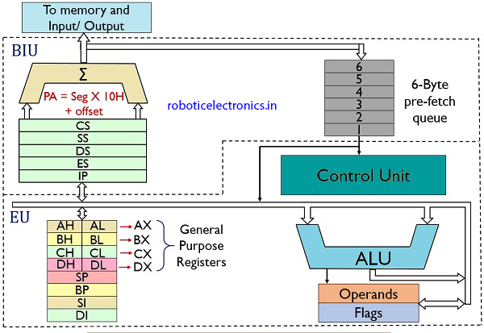
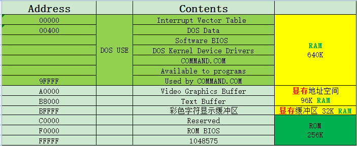
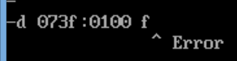
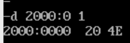
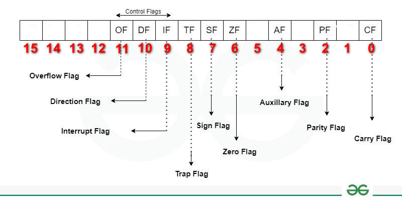

# Learn Assembly Language

## 环境

- VSCodeUserSetup-x64-1.68.1
- win8.1

## 指令和数据

- 指令和数据，都是二进制信息
- 二进制信息 1000100111011000 是数据还是指令
  - 1000100111011000 -> 89D8H(数据)
  - 1000100111011000 -> MOV AX,BX(程序)
- 数据如何表示
  - 1000100111011000**B**（二进制）
  - 89D8**H**（十六进制）

    ```
    四位二进制对应一位十六进制位
    1000-1001-1101-1000
    8----9----D----8
    ```
  - 104730**O**（八进制）
  - 35288**D**（十进制）

## 内存地址空间

- 8086CPU的地址总线宽度为20位，寻址能力为1M
- 运算器一次最多处理16位的数据，寄存器最大宽度为16位
- 8086内部处理的、传输、暂存的地址也是16位
- 用两个16位地址（段地址、偏移地址）合成一个20位的物理地址
- 内存并没有分段，段的划分来自于**CPU**

## 8086CPU架构



## 8086寄存器

8086CPU有14个寄存器

1. 通用寄存器
   1. **AX**(Accumulator Register), and preferred for most operations.
   2. **BX**(Base Register), typically used to hold the address of a procedure or variable.
   3. **CX**(Counter Register), typically used for looping.
   4. **DX**(Data Register), typically used for multiplication and division.
   5. **最大值** FFFFH
2. 变址寄存器
   1. **SI**(Source Index), used for copying strings, segment register varies
   2. **DI**(Destination Index), used for destination for copying strings
   3. **[注意]SI**和**DI***不能够*分成两个8位寄存器来使用
3. 指针寄存器
   1. **SP**(Stack Pointer), offset from SS register as to the location of the stack's top
   2. **BP**(Base Pointer), offset from **SS register** to locate variables on the stack
4. 指令指针寄存器
   1. **IP**(Instruction Pointer), offset from the CS for the next instrunction to excute
5. 段寄存器
   1. **CS**(Code Segment), base location of program code
   2. **SS**(Stack Segment), base location of the stack
   3. **DS**(Data Segment), base location for variables
   4. **ES**(Extra Segment), additional base location for variables in memory
6. 标志寄存器 **PSW**(Program Status Word , also called Flag register)
   1. **Program Status Word** , also called Flag **register**

8086CPU所有寄存器都是***16***位的，可以存放两个***字节***

## 8086内存使用情况



## 32位EAX,EBX, ECX, and EDX registers'

> The new registers are prefaced with an “E” to indicate that they are the “Extended” registers.

## 汇编指令(不区分大小写)

mov ax, 18  	寄存器AX = 18

add ax, 8 	AX = AX + 8

mov ax, bx	AX = BX

add ax, bx	AX = AX + BX

备注： 没有指定进制，默认为**十进制**

## DEBUG调试工具

***R*** 							查看寄存器内容

**R 寄存器名（回车）**			改变指定寄存器内容

**R寄存器名（回车）**				改变指定寄存器内容

---

**D**							查看内存中的内容（默认128个字节）

**D 段地址:偏移地址 结尾偏移**		列出内存中指定地址范围内的内容（显示 ***结尾偏移*** + 1 个）

***注意：结束地址要大于起始地址，否则就会报错***



---

**E 段地址:偏移地址 数据1 数据2 ...**
    改变内存中的内容

**E 段地址:偏移地址**

* **逐个询问式修改**
* **空格（接受），继续**
* **回车（结束）**

---

**U**							机器指令到汇编指令

eg:

* e 2000:0 b8 23 01 bb 03 00 89 d8 01 d8
* d 2000:0
* u 2000:0

---

**A**							以汇编指令格式写入机器指令

eg:

* a 073f:0100（回车）
* mov ax, 0123
* mov bx, 0003
* mov ax, bx
* add ax, bx
* 回车

---

**T**							执行 ***CS:IP*** 处机器指令

---

**Q**							退出Debug

---

## 转移指令jmp

* 同时修改CS、IP内容
  * jmp 段地址:偏移地址
* 仅修改IP内容
  * jmp ax(类似于 ~~mov IP, ax~~)
  * jmp bx
  * 用寄存器中的值修改IP

## 内存中字的存储

* 16位CPU一个字16位
* 32位CPU一个字32位
* 64位CPU一个字64位

### 8080CPU

* 16位的字存储在一个16位的***寄存器***，**高8位放高字节**，**低8位放低字节**
* mov ax, 4E20
  * AH: 4EH	AL:20H
* 16位的字在***内存***中需要2个***连续***字节存储，**低位字节存在低地址单元**，**高位字节存在高地址单元**
  * 20000D（***4E20H***），存放0、1两个单元，18D（***0012H***）存放在2、3两个单元
  * | 地址编号 | 内容 |
    | -------- | ---- |
    | 0        | 20H  |
    | 1        | 4EH  |
    | 2        | 12H  |
    | 3        | 00H  |
    |          |      |
* 实验
  * DS=2000
  * mov ax, 4E20
  * mov [0], ax
  * 执行命令
  * d命令查看内存 2000:0 位置的数据

### 从内存单元中读取数据

> DS和[address]配合，DS存放段地址
>
> mov bx, 1000
>
> mov ds, bx

#### 累加*单元中*数据

> mov ax, 123B
>
> mov ds, ax
>
> mov al, 0
>
> add al, [**0**]
>
> add al, [**1**]
>
> add al, [**2**]

#### 累加*字型*数据

> mov ax, 123B
>
> mov ds, ax
>
> mov ax, 0
>
> add ax, [**0**]
>
> add ax, [**2**]
>
> add ax, [**4**]

## 栈

PUSH	入栈

POP		出栈

> push ax
>
>> 1. SP = SP -2
>> 2. 将ax中的数据送入SS:SP指向的内存单元处，SS:SP此时指向新栈顶
>>

> pop ax
>
>> 1. 将SS:SP指向的内存单元处的数据送入ax中
>> 2. SP = SP + 2, SS:SP 指向当前栈顶下面的单元，以当前栈顶下面的单元为新的栈顶
>>

**以*字*为单位对栈进行操作**

> **堆栈**是向***低端***地址生长的
>
> eg:
>
> ***初始化***	ax:001A	bx:001B	SS:1000	SP:0010
> push ax					SS:1000	SP:000E
> push bx					SS:1000	SP:000C

## 编译运行

> 分步执行
>
> masm xxx.asm

> 简化执行
>
> masm xxx.asm**;**

> link xx.OBJ
>
> link xx.OBJ;

## debug跟踪程序

> debug main.exe
>
> DS: 存放程序所在内存区的段地址。
>
> 前256个字节寸 PSP（Program Segment Prefix）， DOS用来和程序进行通信
>
> CS：程序代码的起始
>
> CX：存放代码的长度(字节 )

### 执行程序

> 命令p(proceed) 类似命令t，逐条执行指令、显示结果。但遇子程序、中断等时，直接执行，然后显示结果
>
> 命令g(go)：从指定地址处开始运行程序，直到遇到断点或者程序正常结束

## loop

> loop 标号
>
> 机器码包含的是位移（负数用补码表示的）

### CPU执行loop指令时要进行的操作

1. (cx)=(cx)-1
2. 判断cx中的值
   1. 不为0则转至标号处执行程序
   2. 如果为0则向下执行

## 定义字型数据

dw（define word）

> dw 0123H, 0456H

db（define byte）

dd（define double word）

## 处理字符

> 汇编程序中，用'.....'的方式指明数据是以字符的形式给出的
>
> db 'unIX'

## [bx+idata]的含义

> mov ax, [200+bx]
>
> mov ax, [bx+200]
>
> mov ax, 200[bx]
>
> mov ax, [bx].200
>
> 上述四种写法意思相同

## [bx+si]

> mov ax, [bx+si]
>
> mov ax, [bx][si]
>
> 上述两种写法意思相同

## [bx+si+idata]

> mov ax, [bx+200+si]
>
> mov ax,[200+bx+si]
>
> mov, ax,200[bx][si]
>
> ***为结构化数据的处理提供了方便***

## 内存寻址方式

|     形式     |       名称       | 示例                            |
| :-----------: | :--------------: | ------------------------------- |
|    [idata]    |     直接寻址     | mov ax, [200]                   |
|     [bx]     |  寄存器间接寻址  | mov bx, 0<br />mov ax, [bx]     |
|  [bx+idata]  |  寄存器相对寻址  | mov bx, 4<br />mov ax, [bx+200] |
|    [bx+si]    |   基址变址寻址   | mov ax, [bx+si]                 |
| [bx+si+idata] | 相对基址变址寻址 | mov ax, [bx+si+200]             |

### 那些寄存器用于寻址

> **BX、SI、DI、BP**

> 正确的指令
>
> mov ax, [bx]
>
> mov ax, [bx+si]
>
> mov ax, [bx+di]
>
> mov ax, [bp]
>
> mov ax, [bp+si]
>
> mov ax, [bp+di]
>
> **备注：只有BX、BP、SI、DI可以用在[...]对内存单元寻址**

### BX、BP区别

> bx默认指 DS 段
>
> bp默认指 SS 段

### 汇编中数据位置的表单

1. 立即数（直接包含在机器指令中的数据）

   ```
   mov ax,1
   add bx, 2000h
   or bx, 00010000b
   mov al, 'a'
   ```
2. 寄存器
3. 内存（段地址())和偏移地址(EA)）

### 指令要处理的数据有多长

1. 字word操作
2. 字节byte操作
3. 用word ptr或byte ptr指明
   1. mov word ptr ds:[0], 1
   2. inc word ptr [bx]
   3. inc word ptr ds:[0]
   4. add word ptr [bx], 2
   5. mov byte ptr ds:[0], 1
   6. inc byte ptr [bx]
   7. inc byte ptr ds:[0]
   8. add byte ptr [bx], 2

## div指令

指令格式：

> div 寄存器

> div 内存单元

| 被除数 | AX              | DX和AX           |
| ------ | --------------- | ---------------- |
| 除数   | 8位内存或寄存器 | 16位内存或寄存器 |
| 商     | AL              | AX               |
| 余数   | AH              | DX               |

## dup功能和用法

> dup和db、dw、dd等数据定义伪指令配合使用，用来进行数据的重复

| 指令                  | 功能                                     | 相当于                  |
| --------------------- | ---------------------------------------- | ----------------------- |
| db 3 dup(0)           | 定义了3个字节，它们的值都是0             | db 0,0,0                |
| db 3 dup(0,1,2)       | 定义了9个字节，由0，1，2重复三次         | db 0,1,2,0,1,2,0,1,2    |
| db 3 dup('abc','ABC') | 定义了18个字节，构成'abcABCabcABCabcABC' | db 'abcABCabcABCabcABC' |

格式如下：

> db 重复的次数 dup(重复的字节型数据)
>
> dw 重复的次数 dup(重复的字型数据)
>
> dd 重复的次数 dup(重复的双字数据)

## 流程转移与子程序

### 转移指令

1. 可以控制CPU执行内存中某处代码的指令
2. 可以修改IP，或同时修改CS和IP的指令

> 按转移行为分：
>
> 段内转移：只修改IP， 如 jmp ax
>
> 段间转移：同时修改CS和IP， 如jmp 1000:0

> 根据指令对IP修改的范围不同：
>
> 段内短转移：IP修改范围为-128~127
>
> 段内近转移：IP修改范围为-32768~32767

> 按转移指令分：
>
> 无条件转移指令：jmp
>
> 条件转移指令：j**cx**z
>
> 循环指令：loop
>
> 过程
>
> 中断

### 用操作符offset取得标号的偏移地址

格式：

> offset 标号

### jmp指令

* 段间转移： jmp 2000:1000
  * jmp far ptr 指明了跳转到的***目的地址***
* 段内短转移： jmp short 标号；IP修改范围 -128~127，8位的位移
  * (IP)=(IP)+8位位移
  * 8位位移=“标号”处的地址 **-** jmp指令后的第一个字节的地址
* 段内近转移： jmp near ptr 标号；IP修改范围 -32768~32767，16位的位移
  * 指明了***相对于当前IP的转移位移***

> jmp short的**机器指令中**，***包含的***是跳转到指令的***相对位置***，而不是转移的目标地址
>
> 原理如下：
>
> 1. (IP)=0003, CS:IP指向EB 05（jmp的机器码）
> 2. 读取指令码EB 05进入指令缓冲器
> 3. （IP）=(IP) + 所读取指令的长度=（IP）+2 =0005，CS：IP指向 add ax, 0001
> 4. cpu执行指令缓冲器中的指令EB 05
> 5. 指令EB 05执行后，（IP）=（IP）+05=000AH, CS:IP指向 inc ax

#### 转移地址在寄存器中的jmp

格式： jmp 16位寄存器

> 段内近转移

#### 转移地址在内存中的jmp

> 段内转移	jmp word ptr 内存单元地址
>
> 从内存单元地址处开始存放着**一个字**，是转移的目的**偏移地址**
>
> mov ax, 0123H
>
> mov ds:[0], ax
>
> jmp word ptr ds:[0]
>
> 执行后，（IP）=0123H

> 段间转移	jmp dword ptr 内存单元地址
>
> 从内存单元地址处开始存放着**两个字**，高地址处的字是转移的目的**段地址**，低地址是**偏移地址**
>
> mov ax, 0123H
>
> mov ds:[0], ax
>
> mov word ptr ds:[2],0
>
> jmp dword ptr ds:[0]
>
> 执行后，
>
> （CS）=0
>
> （IP）=0123H
>
> CS:IP指向0000:0123

### jcxz

> jcxz 标号
>
> * 如果（cx）=0，则转移到标号处执行
>   * （IP）=（IP）+8位位移
> * 当（cx）≠0时，什么也不做（程序向下执行）
>
> 短转移，对IP的修改范围为-128~127
>
> 对应的机器码中包含转移的位移

## 模块化程序设计

### call指令

> 调用子程序
>
> 格式： call 标号
>
> CPU执行call指令，进行两步操作：
>
> 1. 将当前的IP或CS和IP压入栈中
>    1. （SP）=(SP)-2
>       ((ss)*16+(sp))=(IP)
>    2. 相当于 push IP
> 2. 转移到标号处执行指令
>    1. (IP)=(IP)+16位位移
>    2. 相当于 jmp near ptr 标号

#### call far ptr 标号

> 段间转移
>
> 1. (SP)=(SP)-2
> 2. ((SS)*16+(SP))=(CS)
> 3. (SP)=(SP)-2
> 4. ((SS)*16+(SP))=(IP)
>
> 相当于：
>
> push CS
>
> push IP
>
> jmp far ptr 标号

#### 转移地址在内存中的call指令

> call word ptr 内存单元地址
>
> 相当于：
>
> push IP
>
> jmp word ptr 内存单元地址

```
mov sp, 10H
mov ax, 0123H
mov ds:[0], ax
call word ptr ds:[0]
执行后：（IP）=0123H， （SP）=0EH
```

> call dword ptr 内存单元地址
>
> 相当于：
>
> push CS
>
> push IP
>
> jmp dword ptr 内存单元地址

```
mov sp, 10H
mov ax, 0123H
mov ds:[0], ax ;低地址放偏移地址
mov word ptr ds:[2],0 ;高地址放段地址
call dword ptr ds:[0]
执行后，（CS）=0，（IP）=0123H， （SP）=0CH
```

### 返回指令 ret和retf

|        | ret                                  | retf                                           |
| ------ | ------------------------------------ | ---------------------------------------------- |
| 功能   | 用栈中的数据修改IP的内容，实现近转移 | 用栈中的数据，修改CS和IP的内容，从而实现远转移 |
| 相当于 | pop IP                               | pop IP<br />pop CS                             |


## 乘法 mul

|                | 8位乘法                                                                                   | 16位乘法                                                                                                                       |
| -------------- | ----------------------------------------------------------------------------------------- | ------------------------------------------------------------------------------------------------------------------------------ |
| 被乘数（默认） | **AL**                                                                              | **AX**                                                                                                                   |
| 乘数           | 8位寄存器或内存字节单元                                                                   | 16位寄存器或内存字单元                                                                                                         |
| 结果           | **AX**                                                                              | **DX**（高位）和**AX**（低位）                                                                                     |
| 例子           | mul bl<br />-- (ax)=(al)*(bl)<br /><br />mul byte ptr ds:[0]<br />--(ax)=(al)*((ds)*16+0) | mul word ptr [bx+si+8]<br />-- (ax)=(ax)*((ds)*16+(bx)+(si)+8)结果的低16位;<br />(dx)=(ax)*((ds)*16+(bx)+(si)+8)结果的高16位； |
|                | 计算100*10<br />mov al, 100<br />mov bl, 10<br />mul bl<br />结果：(ax)=1000(03E8H)       | 计算100*10000<br />mov ax, 100<br />mov bx, 10000<br />mul bx<br />结果: (dx)=000FH, (ax)=4240H; 即：F4240H                    |


## 寄存器冲突

> 在子程序开始前，将要用到的寄存器中的内容都保存起来，在子程序返回前再恢复


## 标志寄存器




[参考地址](https://thestarman.pcministry.com/asm/debug/8086REGs.htm)

> TF Trap Flag - not shown in MS-DEBUG)

<pre><b>          FLAGS            SET (a 1-bit)   CLEARed (a 0-bit)
 ---------------          --------------- -------------------
       Overflow   of  =    OV (OVerflow)   NV [No oVerflow]

      Direction   df  =    DN (decrement)  UP (increment)

      Interrupt   if  =    EI  (enabled)   DI (disabled)

           Sign   sf  =    NG (negative)   PL (positive)

           Zero   zf  =    ZR   [zero]     NZ  [ Not zero]

Auxiliary Carry   af  =    AC              NA  [ No AC ]

         Parity   pf  =    PE  (even)      PO  (odd)

          Carry   cf  =    CY  [Carry]     NC  [ No Carry]</b></pre>


<pre><b>The individual abbreviations appear to have these meanings:

OV = OVerflow, NV = No oVerflow.    DN = DowN,  UP (up).
EI = Enable Interupt, DI = Disable Interupt.

NG = NeGative, PL = PLus; a strange mixing of terms due to the
     fact that 'Odd Parity' is represented by PO (so it can't
     be as POsitive here), but they still could have used 'MI'
     and for the word, MInus; instead of 'NeGative'.

ZR = ZeRo,  NZ = Not Zero.
AC = Auxiliary Carry, NA = Not Auxiliary carry.
PE = Parity Even, PO = Parity Odd.  CY = CarrY, NC = No Carry.</b></pre>


<pre><b>      of df if tf sf zf    af    pf    cf
      ----------------------------------- 
           Symbols used by MS-DEBUG
      -----------------------------------
      OV DN EI    NG ZR    AC    PE    CY  ---> When bit = 1
      NV UP DI    PL NZ    NA    PO    NC  ---> When bit = 0

     |xx|xx|xx|<font color="red">--</font>|xx|xx| <font color="red">0</font>|xx| <font color="red">0</font>|xx| <font color="red">1</font>|xx|    Newer Designations:
Bits: <font color="#008000">11 10  9  8  7  6  5  4  3  2  1  0</font>
       |  |  |  |  |  |  |  |  |  |  |  '---  <font color="blue">CF - Carry</font> Flag
       |  |  |  |  |  |  |  |  |  |  '---  <font color="red">is always a 1</font>
       |  |  |  |  |  |  |  |  |  '---  <font color="blue">PF - Parity</font> Flag
       |  |  |  |  |  |  |  |  '---  <font color="red">is always a 0</font>
       |  |  |  |  |  |  |  '---  <font color="blue">AF - Auxiliary</font> (Carry) Flag
       |  |  |  |  |  |  '---  <font color="red">is always a 0</font>
       |  |  |  |  |  '---  <font color="blue">ZF - Zero</font> Flag
       |  |  |  |  '---  <font color="blue">SF - Sign</font> Flag
       |  |  |  '---  (<font color="red">TF Trap Flag - not shown in</font> MS-DEBUG)
       |  |  '---  <font color="blue">IF - Interrupt</font> Flag
       |  '---  <font color="blue">DF - Direction</font> Flag
       '---  <font color="blue">OF - Overflow</font> Flag</b></pre>

### ZF

> 标记相关指令的计算**结果是否为0**

### PF

> 记录指令执行后，结果的所有**二进制位中1的个数**

### SF

> 记录指令执行后，将结果视为**有符号数（正负）**
>
> SF标志是CPU对有符合数运算结果的一种记录。将数据当作有符合数来运算的时候，通过SF可知结果的正负；将数据当作无符号数来运算，SF的值则没有意义，虽然相关的指令影响了它的值

### CF

> 在进行无符号数运算的时候，CF记录了运算结果的**最高有效位**向**更高位**(假想的)进位值，或从更高位的借位值

### OF

> 在进行有符号数运算的时候，如结果超过了机器所能表示的范围称为**溢出**


## adc带进位加法

| 指令 | mov al, 98H<br />add al, al<br />adc al, 3 | mov ax, 1<br />add ax, ax<br />adc ax, 3 | mov ax, 2<br />mov bx, 1<br />sub bx, ax<br />adc ax, 1 |
| ---- | :----------------------------------------- | :--------------------------------------- | ------------------------------------------------------- |
| 结果 | (ax)=34H                                   | (ax)=5                                   |                                                         |
| 解释 | adc执行时，<br />(ax)+3+CF=30H+3+1=34H     | adc执行时，<br />(ax)+3+CF=2+3+0=5       |                                                         |


> ***inc指令不会产生进位***


## sbb带借位减法指令

> eg: sbb ax, bx
>
> (ax)=(ax)-(bx)-CF


## 缩写简介

> pushf（push flags）、popf（pop flags）、xchg（exchange）
>
> shl（shift logic left）、shr（shift logic right）、sal（shift arithmetic left）、sar（shift arithmetic right）、rol（rotate left）、ror（rotate right）、rcl（rotate left through carry）、rcr（rotate right through carry）
>
> cld（clear direction）、std（set direction）、cli（clear interrupt）、sti（set interrupt）、nop（no operation）、clc（clear carry）、cmc（carry make change）、stc（set carry）、hlt（halt）、wait、esc（escape）
>
> sub（substract）、adc（add with carry）、sbb（substract with borrow）、inc（increase）、dec（decrease）、cmp（compare）、imul（integer multiplication）、idiv（integer divide）、aaa（ASCII add with adjust）
>
> xor（exclusive or）
>
> mov（move）
>
> int（interrupt）、iret（interrupt return）
>
> jmp（jump）
>
> jcxz（jump if CX is zero）、je（jump if equal）、jb（jump if below）、ja（jump if above）、jnb（jump if not below）、jna（jump if not above）
>
> retf（return far）


[错误汇编指令集](ERROR_COMMAND.md "错误汇编指令集")
